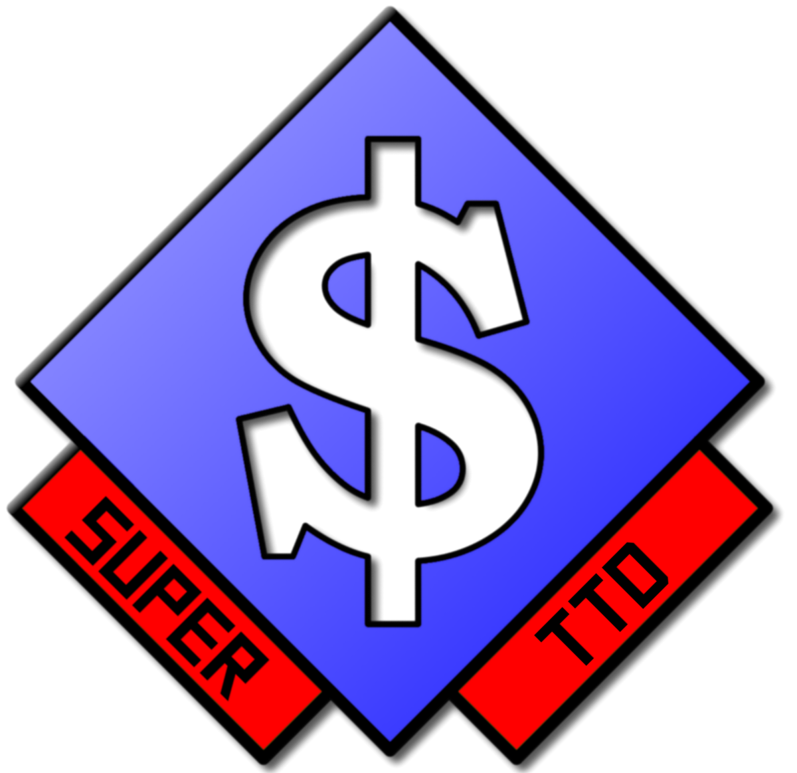

# SuperTTD 
[](https://www.gnu.org/licenses/old-licenses/gpl-2.0.txt)  
*An expandable version of OpenTTD!*

## Compilation
Install the appropiate libraries. Probably one of the following commands:
```shell
sudo apt install libsfml-dev libyaml-cpp-dev # Debian/Ubuntu
sudo pacman -S sfml yaml-cpp # Arch Linux
sudo dnf install SFML yaml-cpp # Fedora (might not work)
brew install sfml yaml-cpp # Might work
```
### ...on Windows
*You will have to install dependencies manually.* See https://www.sfml-dev.org/
for instructions on installing SFML, and build
[yaml-cpp](https://github.com/jbeder/yaml-cpp). Use Git Bash or WSL to run `make`.

## Licenses

The code of SuperTTD is under the GPL 2.0 License. The graphics
are under the Creative Commons Attribution-NoCommercial-ShareAlike
4.0 International License. **See the COPYING file for more info.**
